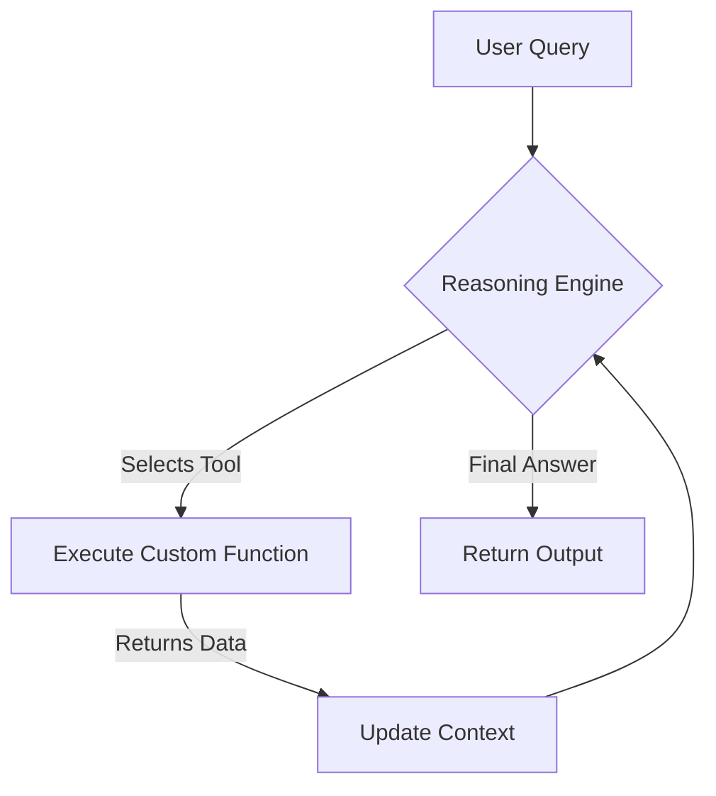

# Orchestration & Decision Loops with Google GenAI SDK

This guide details how to build custom agent orchestration loops, state variables, structured extraction workflows, and multi-step reasoning processes using the new **Google GenAI SDK** (`google-genai`) in Python.

---

## 1. Google GenAI SDK Fundamentals

Google's unified `google-genai` SDK replaces legacy libraries. It supports both **Gemini Developer API (AI Studio)** and **Vertex AI (Enterprise)**.

### Client Initialization Patterns
```python
from google import genai
from google.genai import types

# OPTION A: Google Cloud Vertex AI (Uses GCP credits/permissions)
client = genai.Client(
    enterprise=True,
    project="curator-research",
    location="us-central1"
)

# OPTION B: Developer API Key (AI Studio)
# client = genai.Client(api_key="AIzaSy...")
```

---

## 2. Structured Extraction (Pydantic Integration)

Modern agents require structured data (JSON) rather than conversational text to make routing decisions. The `google-genai` SDK natively supports Pydantic models for strict output format enforcement.

### Code Example: Extracting Compliance Checklists
```python
from pydantic import BaseModel, Field
from typing import List

# 1. Define target Schema
class ComplianceAuditItem(BaseModel):
    clause_id: str = Field(description="The section or clause reference (e.g. 4.2(a))")
    requirement: str = Field(description="Summary of what the regulated entity must do")
    action_required: str = Field(description="Concrete step the company must take to comply")
    risk_level: str = Field(description="Risk level: HIGH, MEDIUM, LOW")

class ComplianceReport(BaseModel):
    company_name: str
    circular_reference: str
    auditor_verdict: str = Field(description="Is the company compliant? COMPLIANT, NON-COMPLIANT, PARTIAL")
    checklist: List[ComplianceAuditItem]

# 2. Query Gemini with structured constraint
response = client.models.generate_content(
    model="gemini-2.5-pro",
    contents="Analyze the onboarding audit logs for India PMS Ltd against circular RBI-2026-104.",
    config=types.GenerateContentConfig(
        response_mime_type="application/json",
        response_schema=ComplianceReport,
        temperature=0.1
    )
)

# 3. Parse output directly
import json
report_data = json.loads(response.text)
print("Auditor Verdict:", report_data["auditor_verdict"])
```

---

## 3. Designing Autonomous Decision Loops (ReAct Pattern)

An autonomous agent runs a loop (Reasoning -> Action -> Observation) until a specific condition is satisfied.



### Code Example: Custom ReAct Auditor Loop
```python
import time

def check_credit_score_database(company_name: str) -> int:
    """Queries the local DB for a company's internal credit rating score."""
    # Mock lookup
    if "green power" in company_name.lower():
        return 720
    return 600

def get_compliance_flags(company_name: str) -> bool:
    """Checks if there are active compliance warnings on the company."""
    return False

# Agent Loop
class LoanApprovalAuditorAgent:
    def __init__(self, client: genai.Client):
        self.client = client
        self.max_iterations = 5
        self.tools = {
            "check_credit_score_database": check_credit_score_database,
            "get_compliance_flags": get_compliance_flags
        }

    def run(self, company_name: str) -> str:
        context = f"Evaluate loan risk suitability for: {company_name}."
        
        for iteration in range(self.max_iterations):
            prompt = (
                f"{context}\n\n"
                "You have access to tools: check_credit_score_database, get_compliance_flags.\n"
                "Determine if we need to call a tool or can make a final assessment (APPROVE / REJECT).\n"
                "State your thoughts, followed by 'Action: <tool_name>(<argument>)' or 'Verdict: <final_answer>'."
            )
            
            response = self.client.models.generate_content(
                model="gemini-2.5-flash",
                contents=prompt
            )
            text = response.text
            print(f"[Loop Iteration {iteration+1}] Agent reasoning: {text}")

            if "Verdict:" in text:
                return text.split("Verdict:")[-1].strip()
            
            if "Action:" in text:
                action_line = text.split("Action:")[-1].strip().split("\n")[0]
                # Simple parsing of 'tool_name(argument)'
                tool_name = action_line.split("(")[0].strip()
                arg = action_line.split("(")[1].replace(")", "").replace("'", "").replace("\"", "").strip()
                
                if tool_name in self.tools:
                    print(f"-> Executing Tool: {tool_name} with arg: {arg}")
                    result = self.tools[tool_name](arg)
                    context += f"\nObservation: Tool {tool_name} returned: {result}"
                else:
                    context += f"\nObservation: Tool {tool_name} does not exist."
            else:
                context += "\nObservation: Invalid format. Please state an Action or a Verdict."
            
            time.sleep(1) # Rate limit protection
            
        return "ERROR: Agent failed to converge in maximum iterations."

# Run Agent
if __name__ == "__main__":
    auditor = LoanApprovalAuditorAgent(client)
    final_verdict = auditor.run("Transtech Green Power Private Limited")
    print("\nFinal Decision:", final_verdict)
```

---

## 4. Migrating LangGraph Multi-Agent Workflows to Serverless ADK

In our monorepo, Bija employs a 6-node LangGraph workflow (`intake` -> `hmw` -> `plan` -> `propose` -> `judge` -> `validate`) with four proposer roles. 

To refactor this into Google's serverless ecosystem for the hackathon, we replace LangGraph's state graph with a managed **SequentialAgent** or **State-Driven Runner** running on Vertex AI Agent Engine.

### Refactoring Architecture Mapping:

| LangGraph Element | Vertex AI Serverless Equivalent |
|---|---|
| **Graph Node** | Separate `google.adk.agents.Agent` instances deployed to the Agent Engine. |
| **SharedState Context** | Thread-session IDs saved in a serverless database (Google Cloud Firestore or Memorystore for Redis). |
| **Node Transition / Routing** | Deployed `AgentRouter` or a Master orchestrator class managing sequential calls. |

### Code Example: Refactored Serverless Multi-Agent Orchestrator
```python
from google.adk.agents import Agent
from google.adk.workflows import AgentRouter
from vertexai.agent_engines import AdkApp

# 1. Define Proposer Agents
regulator_skeptic = Agent(
    name="compliance_objector",
    model="gemini-2.5-flash",
    instructions="Review the regulatory impacts. Identify warnings, compliance rules, and audit failures."
)

business_optimist = Agent(
    name="business_proposer",
    model="gemini-2.5-flash",
    instructions="Review the business goals. Highlight customer acquisition benefits and competitive strengths."
)

# 2. Define the Synthesis Judge
synthesis_judge = Agent(
    name="synthesis_judge",
    model="gemini-2.5-pro",
    instructions=(
        "You are the Judge. Gather the opinions from compliance_objector and "
        "business_proposer, synthesize them, and produce a balanced final audit recommendation."
    )
)

# 3. State Orchestration Class
class BrainstormRunner:
    def __init__(self):
        self.proposers = [regulator_skeptic, business_optimist]
        self.judge = synthesis_judge

    def query(self, proposal: str) -> str:
        """Sequential Agent Orchestration Loop"""
        debates = []
        for agent in self.proposers:
            print(f"Consulting agent: {agent.name}...")
            response = agent.run(proposal)
            debates.append(f"Agent {agent.name} says:\n{response}\n")
        
        # Pass collected debate state to the judge
        judge_input = f"Original Proposal: {proposal}\n\nDebate Details:\n" + "\n".join(debates)
        print("Invoking synthesis judge...")
        final_verdict = self.judge.run(judge_input)
        return final_verdict

# 4. Wrap for Serverless Agent Engine Deployment
app = AdkApp(runner=BrainstormRunner())
```
By packaging this structure into `AdkApp`, the entire LangGraph orchestration runtime runs on-demand as a serverless microservice, eliminating VM maintenance, Docker Compose networks, and active memory overhead.
