<!-- render with: npx -y @mermaid-js/mermaid-cli mmdc -i docs/submission/architecture.md -o docs/submission/architecture.svg -->
<!-- render with: npx -y @mermaid-js/mermaid-cli mmdc -i docs/submission/architecture.md -o docs/submission/architecture.png -w 1920 -H 1080 -b white -->

# Curator — System Architecture

```mermaid
%%{init: {'theme':'base','themeVariables':{
  'primaryColor':'#76B900',
  'primaryTextColor':'#0b0b0b',
  'primaryBorderColor':'#0b0b0b',
  'lineColor':'#0b0b0b',
  'secondaryColor':'#ffffff',
  'tertiaryColor':'#f4f4f4',
  'fontFamily':'Inter, Helvetica, Arial, sans-serif',
  'fontSize':'14px',
  'clusterBkg':'#ffffff',
  'clusterBorder':'#0b0b0b'
}}}%%
flowchart LR

  %% =====================================================
  %% USER / EXTERNAL SURFACES
  %% =====================================================
  user([Compliance Officer<br/>browser]):::user
  ext_mcp([External MCP Gateway<br/>partner / Gemini Enterprise]):::external
  rbi([RBI / SEBI / IRDAI<br/>RSS + portals]):::external

  %% =====================================================
  %% CLOUD RUN · DISCOVERY  (asia-south1)
  %% =====================================================
  subgraph CR_DISC["Cloud Run · curator-discovery  (asia-south1)"]
    direction TB
    sched["Cloud Scheduler<br/>*/30 * * * *"]:::infra
    poll["/poll endpoint<br/>(FastAPI)"]:::svc
    feed["feedparser<br/>rss_poller.py"]:::svc
    dedupe["dedupe.py<br/>vs discovered_items"]:::svc
    pub["publisher.py<br/>→ Pub/Sub"]:::svc
    sched --> poll --> feed --> dedupe --> pub
  end

  topic[("Pub/Sub topic<br/>curator-discoveries")]:::infra

  %% =====================================================
  %% CLOUD RUN · CHAIN  (asia-south1)
  %% =====================================================
  subgraph CR_CHAIN["Cloud Run · curator-chain  (asia-south1)"]
    direction TB

    a2a["A2A Skill Card<br/>/.well-known/agent.json<br/>(5–6 skills)"]:::a2a
    ui["Jinja UI<br/>/  +  /inbox"]:::svc
    sub_in["subscriber.py<br/>(Pub/Sub pull)"]:::svc

    %% --- Ingestion lane ---
    subgraph ING["Ingestion lane"]
      direction LR
      upload["PDF upload"]:::svc
      docai["Doc AI<br/>Layout Parser<br/>(us)"]:::gcp_us
      gx["graph_extractor"]:::agent
      upload --> docai --> gx
    end

    %% --- Decompose panel ---
    subgraph DEC["Decompose Panel · ParallelAgent"]
      direction TB
      l1["banker lens"]:::lens
      l2["compliance lens"]:::lens
      l3["auditor lens"]:::lens
      l4["customer_protect lens"]:::lens
      rec1["Reconciler"]:::recon
      refl["Reflector<br/>(low-conf re-query)"]:::recon
      l1 --> rec1
      l2 --> rec1
      l3 --> rec1
      l4 --> rec1
      rec1 --> refl
    end

    %% --- Map step ---
    subgraph MAP["Map · ThreadPoolExecutor"]
      direction TB
      m1["obligation #1"]:::work
      m2["obligation #2"]:::work
      mN["obligation #N"]:::work
    end

    %% --- Diff step ---
    subgraph DIFF["Diff · ThreadPoolExecutor"]
      direction TB
      d1["diff #1"]:::work
      d2["diff #2"]:::work
      dN["diff #N"]:::work
    end

    %% --- Judge panel ---
    subgraph JDG["Judge Panel · ParallelAgent"]
      direction TB
      j1["impact critic"]:::lens
      j2["ICAAP critic"]:::lens
      j3["Pillar-3 critic"]:::lens
      j4["ops-risk critic"]:::lens
      rec2["Reconciler"]:::recon
      j1 --> rec2
      j2 --> rec2
      j3 --> rec2
      j4 --> rec2
    end

    qna["Q&A agent<br/>(cited answers)"]:::agent

    %% --- Observability ---
    subgraph OBS["Observability + self-improvement"]
      direction TB
      runs[("agent_runs<br/>Spanner table")]:::store
      opt["Agent Optimizer<br/>SimplePromptOptimizer<br/>(GEPA-style)"]:::infra
      runs --> opt
      opt -. "evolved prompts" .-> DEC
      opt -. "evolved prompts" .-> JDG
    end
  end

  %% =====================================================
  %% DATA + MODEL PLANES
  %% =====================================================
  spanner[("Spanner Graph<br/>curator-graph / curator<br/>asia-south1")]:::store
  gemini[["Vertex AI · Gemini-flash<br/>routing: global"]]:::gcp_global

  %% =====================================================
  %% EDGES — discovery flow
  %% =====================================================
  rbi --> feed
  pub --> topic
  topic --> sub_in
  sub_in --> ui
  dedupe <--> spanner

  %% =====================================================
  %% EDGES — user flow + chain wiring
  %% =====================================================
  user --> ui
  user --> upload
  ui --> DEC

  gx --> spanner
  DEC -- "obligations" --> MAP
  refl -. "re-query" .-> spanner
  spanner --> DEC
  spanner --> MAP
  MAP --> DIFF
  DIFF --> JDG
  rec2 --> qna
  qna --> ui

  %% Every agent logs to agent_runs
  DEC -. "log span" .-> runs
  MAP -. "log span" .-> runs
  DIFF -. "log span" .-> runs
  JDG -. "log span" .-> runs
  qna -. "log span" .-> runs
  gx  -. "log span" .-> runs

  %% Model plane (dotted = inference call)
  DEC -. "infer" .-> gemini
  MAP -. "infer" .-> gemini
  DIFF -. "infer" .-> gemini
  JDG -. "infer" .-> gemini
  qna -. "infer" .-> gemini
  gx  -. "infer" .-> gemini

  %% A2A surface
  a2a --- qna
  a2a --- DEC
  ext_mcp <== "A2A consumer<br/>IP-wall preserved" ==> a2a

  %% =====================================================
  %% STYLES
  %% =====================================================
  classDef user fill:#ffffff,stroke:#0b0b0b,stroke-width:2px,color:#0b0b0b
  classDef external fill:#f4f4f4,stroke:#0b0b0b,stroke-width:1px,color:#0b0b0b
  classDef svc fill:#ffffff,stroke:#0b0b0b,color:#0b0b0b
  classDef agent fill:#76B900,stroke:#0b0b0b,stroke-width:1.5px,color:#0b0b0b
  classDef lens fill:#B8E986,stroke:#0b0b0b,color:#0b0b0b
  classDef recon fill:#4F8A10,stroke:#0b0b0b,color:#ffffff
  classDef work fill:#E8F5D6,stroke:#0b0b0b,color:#0b0b0b
  classDef store fill:#0b0b0b,stroke:#76B900,stroke-width:2px,color:#ffffff
  classDef infra fill:#ffffff,stroke:#0b0b0b,stroke-dasharray: 4 2,color:#0b0b0b
  classDef gcp_us fill:#fff7d6,stroke:#0b0b0b,color:#0b0b0b
  classDef gcp_global fill:#d6e4ff,stroke:#0b0b0b,color:#0b0b0b
  classDef a2a fill:#0b0b0b,stroke:#76B900,stroke-width:2px,color:#76B900

  style CR_CHAIN fill:#fafffa,stroke:#76B900,stroke-width:2px
  style CR_DISC  fill:#fafffa,stroke:#76B900,stroke-width:2px
  style ING  fill:#ffffff,stroke:#0b0b0b
  style DEC  fill:#f4faec,stroke:#4F8A10,stroke-width:1.5px
  style MAP  fill:#ffffff,stroke:#0b0b0b
  style DIFF fill:#ffffff,stroke:#0b0b0b
  style JDG  fill:#f4faec,stroke:#4F8A10,stroke-width:1.5px
  style OBS  fill:#ffffff,stroke:#0b0b0b,stroke-dasharray: 3 3
```

## Legend

- **Green nodes** = ADK agents (Gemini-flash via Vertex AI).
- **Light-green nodes** = parallel lens / critic sub-agents (ADK `ParallelAgent`).
- **Dark-green nodes** = Reconciler / Reflector (merge + low-confidence re-query).
- **Black cylinders** = Spanner storage (`curator-graph/curator` + `agent_runs` table).
- **Yellow** = Doc AI Layout Parser (US, cross-region — documented in DECISIONS-9).
- **Blue** = Vertex AI Gemini-flash (routed via `global`).
- **Black with green border** = A2A skill-card surface (`/.well-known/agent.json`).
- **Dashed edges** = observability span writes and inference calls.
- **Double-arrow A2A edge** = external MCP / Gemini Enterprise consumer; IP wall preserved (no internal prompts leak).

## Regions

| Plane | Region |
|---|---|
| Cloud Run × 2 (chain + discovery) | `asia-south1` (Mumbai) |
| Spanner Graph + `agent_runs` | `asia-south1` |
| Pub/Sub `curator-discoveries` | `asia-south1` |
| Doc AI Layout Parser | `us` |
| Vertex AI Gemini-flash | `global` routing |
